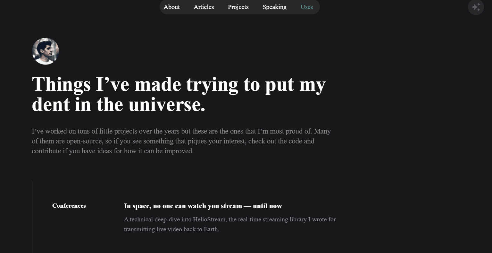
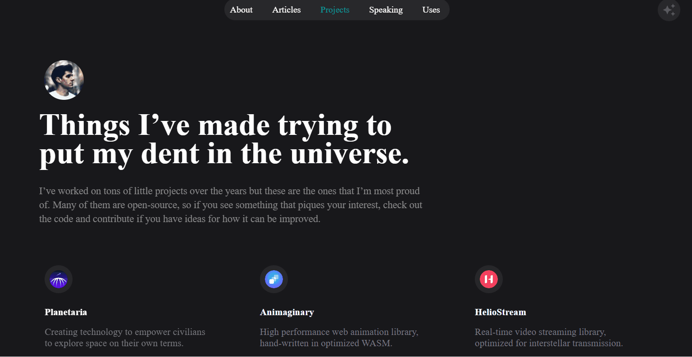

# Modern Personal Website 🌐

A modern and responsive personal website template built with **React.js**, **Material UI**, and **GSAP** animations.  
Designed for showcasing information, projects, and contact details in a clean and visually appealing way.

---

## 🖼 Preview

### NavBar scrolling Animation


### Changin color theme Animation


## 🌐 Live Demo
Check out the live website [here](https://timely-caramel-babf06.netlify.app/)


---

## 🚀 Features
- Fully responsive design for all devices
- Smooth animations using GSAP
- Material UI components for consistent styling
- Organized and maintainable React code structure

---

## 🛠 Technologies Used
- React.js
- Material UI
- GSAP (GreenSock Animation Platform)

---

## 📦 Installation

1. **Clone the repository:**
```bash
git clone https://github.com/sdvsvsdv/personal-website-template.git
```

2. Navigate to the project directory:
```bash
cd personal-website-template
```

3. Install dependencies:
```bash
npm install
```

4. Run the development server:
```bash
npm start
```